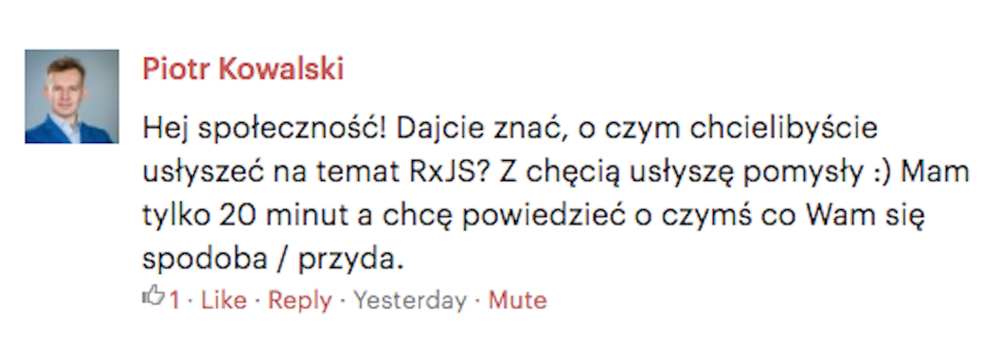

class: middle, center

# RxJS okiem doświadczonego inżyniera

_Podczas prelekcji dowiesz się o co chodzi z RxJS, do czego jest ono przydatne 
Angularowi. Celem wystąpienia jest zaprezentowanie tworzenia oprogramowania 
zgodnie z paradygmatem programowania reaktywnego._

### Piotr Kowalski

<a href="https://github.com/piecioshka/slides-rxjs-look-behind"></a>

---

class: center, middle

# 🎉 Mówię po chachłacku 🎉

---

class: center, middle

## 👞 "Uzułem się w wygodnie" 👞

---

class: center, middle

## 🍹 "Smędzi mnie i muszę się czegoś napić" 🍹

---

class: center, middle

# Asynchroniczność

???

## Q: Co to jest asynchroniczność?

---

### Asynchroniczność - co my tu mamy....

--
## `Callback` (ES1)

--
## `Promise` (ES2015)

--
## `Generators` (ES2015)

--
## `async` / `await` (ES2017)

--
## `Observable` (Stage 1) ✨

---

### `Callback` (ES1)

.size30[
```javascript
const callback = () => {
    // ...
};
const delay = 1234; 

setTimeout(callback, delay);
```
]

---

### `Promise` (ES2015)

.size30[
```javascript
const URL = '//jsonplaceholder.typicode.com/posts';

function request(url) {
    return fetch(url).then(res => res.json());
}

request(URL)
    .then((photos) => {
        console.log(photos);
    });
```
]

---

### `Generators` (ES2015)

.size30[
```javascript
const URL = '//jsonplaceholder.typicode.com/posts';

function request(url) {
    return fetch(url).then(res => res.text())
        .then(res => program.next(res));    // WTF?
}

function * main() {
    let response = yield request(URL);
    console.log('response', JSON.parse(response));
}

const program = main();                     // WTF?
program.next();                             // WTF?
```
]

---

### `Generators` (ES2015) - wyeliminowane WTF-y

```javascript
const URL1 = '//jsonplaceholder.typicode.com/posts';
const URL2 = '//jsonplaceholder.typicode.com/photos';

function request(url) {
    return fetch(url).then(res => res.text())
}

function * main() {
    let response1 = yield request(URL1);
    console.log('posts', JSON.parse(response1));
    let response2 = yield request(URL2);
    console.log('photos', JSON.parse(response2));
}

function runGenerator(generatorConstructor) {
    let generator = generatorConstructor();
    (function next(data) {
        let step = generator.next(data);
        if (step.done) return;
        step.value.then(next);
    })(null);
}

runGenerator(main);
```

---

### `async` / `await` (ES2017)

.size25[
```javascript
const URL1 = '//jsonplaceholder.typicode.com/posts';
const URL2 = '//jsonplaceholder.typicode.com/photos';

async function request(url) {
    const response = await fetch(url);
    return await response.json();
}

async function main() {
    const posts = await request(URL1);
    console.log('posts', posts);

    const photos = await request(URL2);
    console.log('photos', photos);
}

main();
```
]

---

### `Observable` (Stage 1) ✨

.size25[
```javascript
const URL = '//jsonplaceholder.typicode.com/posts';

function request(url, observer) {
    fetch(url)
        .then(res => res.json())
        .then(res => observer.next(res))
        .catch(err => observer.error(err))
        .then(() => observer.complete());
}

Rx.Observable                                // WARNING: vendor
    .create(obs => request(URL, obs))
    .subscribe(
        console.log.bind(console, 'success'),
        console.log.bind(console, 'error'),
        console.log.bind(console, 'complete')
    );
```
]

---

class: center, middle

# Wzorce projektowe

---

class: center, middle

# Wzorzec [`Observer`][observer-wiki]

--
## <mark>Software Design Pattern</mark> 

--
## Podmioty: **Subject**, **Observers**

---

### Wzorzec `Observer`: Przykład

.size30[
```javascript
// Observer pattern

const subject = document;
const observer = () => {
    console.log('from observer');
};

subject.addEventListener('click', observer);
```
]

---

### Biblioteki?

* npm/backbone (Backbone.Events)
* npm/event-emitter
* npm/[super-event-emitter][super-event-emitter]

oraz następujące, których nie sprawdzałem:

* npm/eventemitter2
* npm/eventemitter3
* npm/sparkles

<hr/>

Dlaczego napisałem [swoją wersję?][why-create-own-observer-library]

---

class: center, middle

# Wzorzec [`PubSub`][pub-sub-wiki]

--
## <mark>Messaging Pattern</mark>

--
## Podmioty: **Publisher**, **Subscribers**

---

### Wzorzec `PubSub`: Przykład

.size20[
```javascript
// Publish-subscribe pattern

class DOMPublisher {
    constructor($element, eventName = 'mousemove') {
        this.subscribers = [];
        $element.addEventListener(eventName, (evt) => this.publish(evt));
    }
    publish(data) {
        this.subscribers.forEach(item => item(data));
    }
    subscribe(fn) {
        this.subscribers.push(fn);
    }
}

const publisher = new DOMPublisher(document, 'click');
const subscriber = () => {
    console.log('from subscriber');
};

publisher.subscribe(subscriber);
```
]

---

class: center, middle

# [Różnice?][observer-vs-pubsub-addy]

---

class: center, middle

# RxJS

---

class: center, middle

# <mark>Observable</mark> vs <mark>Subject</mark>

---

exclude: true
class: center, middle

# Observable

---

class: slide-fullscreen-background
background-image: url(./images/observable-80.jpg)

---

class: slide-fullscreen-background
background-image: url(./images/observable-90.jpg)

---

class: slide-fullscreen-background
background-image: url(./images/observable-100.jpg)

---

exclude: true
class: center, middle

# Subject

---

class: slide-fullscreen-background
background-image: url(./images/subject-70.jpg)

---

class: slide-fullscreen-background
background-image: url(./images/subject-80.jpg)

---

class: slide-fullscreen-background
background-image: url(./images/subject-90.jpg)

---

class: slide-fullscreen-background
background-image: url(./images/subject-100.jpg)

---

class: center, middle



## https://www.meetup.com/Angular-Warsaw/events/242530230/

---

### Pytania z <mark>Meetup.com</mark>

.size20[
1. ⛔&nbsp; Dlaczego zespół Angulara zdecydował się na wprowadzenie **RxJS**,
    jako jednego z głównych graczy tego frameworka?
2. ✅&nbsp; **Czy można dobrze korzystać z Angulara bez znajomości **RxJS**?**
3. ✅&nbsp; **Top 10 funkcji **RxJS** niezbędnych do poznania na start.**
4. ⛔&nbsp; Jakie są przypadki użycia tej biblioteki?
5. ✅&nbsp; **Czy w przypadku pojedynczego wywołania REST-owego API serwera
    (w odniesieniu do Angulara) zwracającego prostego JSON-a, lepiej skorzystać
    z obiektu `Observable` czy zamienić to na `Promise`, jaką korzyść daje nam
    `Observable` w tym przypadku?**
6. ⛔&nbsp; Ile czasu zajęło Ci / Twojemu zespołowi opanowanie **RxJS** na poziomie
    niezbędnym do swobodnej pracy?
7. ⛔&nbsp; W jakich przypadkach polecasz używanie **RxJS** - czy w każdym projekcie 
    ma to sens?
8. ⛔&nbsp; Jak poprawnie testować logikę aplikacji opartej na **RxJS**?
]

---

class: center, middle

# <mark>Pytanie 1</mark><br/>Czy można dobrze korzystać z Angulara bez znajomości **RxJS**?

---

### <mark>Pytanie 1</mark> Czy można dobrze korzystać z Angulara bez znajomości **RxJS**?

--
## Router, Forms, Komunikacja z serwerem.

--
## Łatwe?

--
## A co z <mark>Race Condition</mark> 😁

---

### <mark>Race Condition</mark>: Rozwiązanie

.size50[
`switchMap` albo `unsubscribe`

Zobacz: [github.com/piecioshka/angular-rxjs-race-condition-problem][solution]
]

---

class: center, middle

# <mark>Pytanie 2</mark><br/>Top 10 funkcji **RxJS** niezbędnych do poznania na start.

---

### <mark>Pytanie 2</mark> Top 10 funkcji **RxJS** na start

1. `rxjs/observable/from`
2. `rxjs/observable/fromEvent`
3. `rxjs/observable/create`
4. `rxjs/observable/combineLatest`
5. `rxjs/operator/do`
6. `rxjs/operator/concat`
7. `rxjs/operator/map`
8. `rxjs/operator/filter`
9. `rxjs/operator/concatMap`
10. `rxjs/operator/finally`

---

class: center, middle

## <mark>Pytanie 3</mark><br/>Czy w przypadku pojedynczego wywołania REST-owego API serwera (w odniesieniu do Angulara) zwracającego prostego JSON-a, lepiej skorzystać z obiektu `Observable` czy zamienić to na `Promise`, jaką korzyść daje nam `Observable` w tym przypadku?

---

### <mark>Pytanie 3</mark> Czy zamieniłbyś `Observable` w `Promise` dla zapytań HTTP?  

.size50[
Nie.

* Polimorfizm
* Operator `retry`
]

---

class: center, middle

# <mark>Hint 1</mark><br/>Obsługa błędów HTTP?

???

## Q: Jak realizujecie obsługę błędów w waszych aplikacjach?

---

### <mark>Hint 1</mark> Obsługa błędów HTTP?

```typescript
@Injectable()
export class HttpInterceptor extends Http {

    constructor(
        backend: XHRBackend,
        options: RequestOptions,
        public http: Http,
    ) {
        super(backend, options)
    }

    public request(url: string|Request, options?: RequestOptionsArgs): Observable<Response> {
        return super.request(url, options)
            .catch(this.handleError)
    }

    public handleError = (error: Response) => {
        // Do messaging and error handling here
        // - inform error collector
        // - display message to user
        return Observable.throw(response.message)
    }
}
```

---

class: center, middle

# <mark>Hint 2</mark><br/>Debugging

???

## Q: Jak debugujecie swój kod?

---

### <mark>Hint 2</mark> Debugging z użyciem `rxjs-spy`

.size30[
```typescript
import { spy } from 'rxjs-spy';
import 'rxjs-spy/add/operator/tag';

// ...
    fetchSomething() {
        return this.http.get(url)
          .tag('downloading completed')
    }
// ...
```
]

.size30[
```typescript
// in DevTools type:
rxSpy.show();
```
]

---

class: center, middle

# Thanks

<hr />

--
.size50[
20 min 😂
]


[observer-vs-pubsub-addy]: https://addyosmani.com/resources/essentialjsdesignpatterns/book/#observerpatternjavascript
[super-event-emitter]: https://github.com/piecioshka/super-event-emitter
[why-create-own-observer-library]: https://piecioshka.pl/blog/2016/01/29/narzedzia-swiata-super-event-emitter-js.html
[observer-wiki]: https://en.wikipedia.org/wiki/Observer_pattern
[pub-sub-wiki]: https://en.wikipedia.org/wiki/Publish%E2%80%93subscribe_pattern
[solution]: https://github.com/piecioshka/angular-rxjs-race-condition-problem
